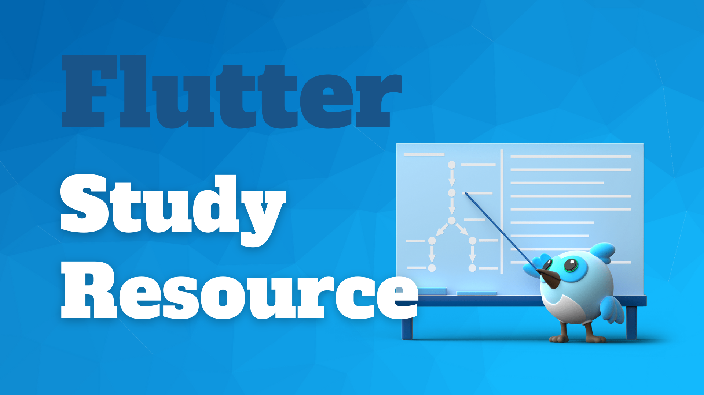

# Study Resource ✍🏼

## Tips, Performance
##### Article
- [Flutter: Rendering Optimization Tips](https://blog.gskinner.com/archives/2022/09/flutter-rendering-optimization-tips.html)

##### Video
- [How to Improve Flutter Performance](https://www.youtube.com/watch?v=KH-3tbD7NoU&ab_channel=StreamChat%26Feeds)
- [Tips, Tricks and Tools: Flutter Performance | Gordon Hayes - FlutterVikings](https://www.youtube.com/watch?v=B3xXkqhqf0Y&list=PL4dBIh1xps-Emd7K4xwX4rdUnfaKFMuna&index=25&ab_channel=FlutterCommunity)

## Widget Tree, Element Tree, RenderObject Tree
##### Article
- [Why is Flutter Fast? — Part 1: Sublinear Building](https://medium.com/flutter-community/why-is-flutter-fast-part-1-sublinear-building-317572cd6b47)
- [Tree surgery](https://docs.flutter.dev/resources/inside-flutter#tree-surgery)

##### Video
- [How Stateful Widgets Are Used Best - Flutter Widgets 101 Ep. 2](https://www.youtube.com/watch?v=AqCMFXEmf3w&ab_channel=GoogleDevelopers)
- [Craig Labenz - Lifecycle Of A Widget]()
- [Draw undrawable with your custom RenderBox! | FlutterVikings 2022](https://www.youtube.com/watch?v=svb41OLzCDY&ab_channel=FlutterCommunity)
- [How to Improve Flutter Performance](https://www.youtube.com/watch?v=KH-3tbD7NoU&ab_channel=StreamChat%26Feeds)

## Widget
##### Video
- [Top 10 Widgets every Flutter Developer should know!](https://www.youtube.com/watch?v=2Dg_5CSWYB4&ab_channel=JohannesMilke)
- [Flutter's Multi-Child Layout Algorithm](https://www.youtube.com/watch?v=_jlXS8chb7g&ab_channel=FlutterCommunity)

## Riverpod
##### Article
- [Flutter Riverpod 2.0: The Ultimate Guide](https://codewithandrea.com/articles/flutter-state-management-riverpod/)
- [Riverpod Data Caching and Providers Lifecycle: Full Guide](https://codewithandrea.com/articles/flutter-riverpod-data-caching-providers-lifecycle/)
- [Riverpod - ConsumerWidget and ConsumerStatefulWidget](https://priiimo.com/en/computer-science/tutorials/riverpod-consumerwidget-and-consumerstatefulwidget/619dfc4d28fbc18880d517ff)
- [How to Auto-Generate your Providers with Flutter Riverpod Generator](https://codewithandrea.com/articles/flutter-riverpod-generator/)
- [How to Unit Test AsyncNotifier Subclasses with Riverpod 2.0 in Flutter](https://codewithandrea.com/articles/unit-test-async-notifier-riverpod/)
- [How to handle loading and error states with StateNotifier & AsyncValue in Flutter](https://codewithandrea.com/articles/loading-error-states-state-notifier-async-value/)
- [Flutter Riverpod: A Guide to Provider](https://dhruvnakum.xyz/flutter-riverpod-a-guide-to-provider)
- [Flutter Riverpod: StateProvider, StateNotifier, StateNotifierProvider, FutureProvider, StreamProvider](https://dhruvnakum.xyz/flutter-riverpod-a-guide-to-provider)
- [Simplify Flutter state management with Riverpod](https://blog.codemagic.io/flutter-state-management-with-riverpod/)
- [Flutter Riverpod State Management Explained](https://www.refactord.com/guides/riverpod-state-management-explained)
- [Flutter Riverpod Filters](https://www.refactord.com/guides/flutter-riverpod-filters)
- [Flutter Riverpod: How to Register a Listener during App Startup](https://github.com/bizz84/flutter-tips-and-tricks/blob/main/tips/0059-register-listener-riverpod/index.md)
- [How to start using Riverpod, StateNotifier and Freezed in your Flutter applications.](https://dev.to/elianmortega/how-to-start-using-riverpod-statenotifier-and-freezed-in-your-flutter-applications-181k)
- [Write best performance ListView with Riverpod in Flutter](https://itnext.io/write-best-performance-listviews-with-riverpod-in-flutter-8bf6590ed8b8)
- [Flutter状态管理之Riverpod](https://blog.csdn.net/qq_17766199/article/details/108352306)
- [Flutter Riverpod 輕鬆學，簡單處理狀態管理！](https://yiichenhi.medium.com/riverpod-%E8%BC%95%E9%AC%86%E5%AD%B8-%E5%8E%9F%E4%BE%86%E9%80%99%E9%BA%BC%E5%A5%BD%E7%94%A8-7e7b231570bc)
- [Flutter Riverpod 輕鬆學(二)，一些進階用法！](https://yiichenhi.medium.com/riverpod-輕鬆學-二-一些進階用法-80acf4f27ef4)

##### Video
- [Riverpod 2.0 - Remi Rousselet | FlutterVikings 2022](https://www.youtube.com/watch?v=CzHt_uwmlXM&ab_channel=FlutterCommunity)
- [Riverpod 2.x Course for Flutter Developers - Go From Beginner to Advanced in 17 Hours](https://www.youtube.com/watch?v=vtGCteFYs4M&ab_channel=VandadNahavandipoor)
- [Riverpod Last Stable Version](https://www.youtube.com/watch?v=HbrtQYEPsoo&list=PLzaGtnxLcM7HYt-MhMZ-j0Bmeo4RqPHoS&ab_channel=Aspiiire)

##### Project
- [vandadnp/youtube-riverpodcourse-public](https://github.com/vandadnp/youtube-riverpodcourse-public)
- [zh6/flutter_plus](https://github.com/zh6/flutter_plus)
- [MarcusNg/flutter_shopping_list](https://github.com/MarcusNg/flutter_shopping_list)
- [antonio-nicolau/flutter-riverpod-example-with-solid-principles](https://github.com/antonio-nicolau/flutter-riverpod-example-with-solid-principles)

## Sliver, ScrollView
##### Video
- [Lazy Flutter performance | Session](https://www.youtube.com/watch?v=qax_nOpgz7E&t=182s&ab_channel=Flutter)
- [Food or Restaurant App - Main Page | Flutter](https://www.youtube.com/watch?v=cvAw9wucmBc&ab_channel=TheFlutterWay)

## Animation
##### Video

## Design System
##### Video
- ["Design system in a large Flutter app. Developer’s perspective." – Design system in banking app](https://www.youtube.com/watch?v=aK4A9145xOI&ab_channel=FlutterWarsaw)

## Design Pattern
##### Project
- [Mangirdas Kazlauskas - Flutter Design Patterns](https://flutterdesignpatterns.com/)

---

## Contribute
- You can star and share with other developers if you feel good and learn something from this repository.
- If you have some ideas, please discuss them with me or commit PR.

## More of me

## Donate and encourage me
[![BuyMeACoffee][buy_me_a_coffee_badge]][buy_me_a_coffee]

<!-- Links -->
[buy_me_a_coffee]: https://www.buymeacoffee.com/yiichenhi
[buy_me_a_coffee_badge]: https://img.buymeacoffee.com/button-api/?text=Sponsor&emoji=&slug=yiichenhi&button_colour=FFDD00&font_colour=000000&font_family=Cookie&outline_colour=000000&coffee_colour=ffffff&size=64
